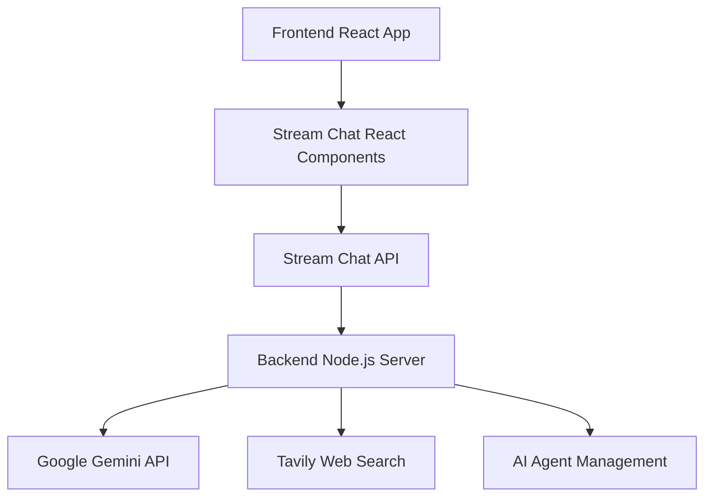

Got it ✅ Jay — here’s the **fully structured README in code block format** so you can copy–paste it directly into your `README.md` file without losing formatting:

````markdown
# Chat AI App

A modern AI-powered chat application built with **Stream Chat**, **Google Gemini**, and **web search capabilities**.  
This full-stack application provides an intelligent writing assistant that can help with content creation, research, and real-time collaboration.

---

## 🚀 Features

- **Real-time Chat**: Powered by [GetStream.io](https://getstream.io) for seamless messaging  
- **AI Writing Assistant**: Google Gemini integration for intelligent content generation  
- **Web Search**: Live web search capabilities using Tavily API for current information  
- **Modern UI**: Beautiful React interface with dark/light theme support  
- **Writing Prompts**: Categorized prompts for business, content, communication, and creative tasks  
- **Agent Management**: Dynamic AI agent lifecycle management  
- **Secure Authentication**: JWT-based token authentication  
- **Responsive Design**: Mobile-first design with Tailwind CSS  

---

## 🏗️ Architecture

### Backend (`nodejs-ai-assistant/`)
- Node.js / Express server  
- Stream Chat server-side integration  
- Google Gemini API for AI responses  
- Tavily API for web search functionality  
- Agent management system with automatic cleanup  

### Frontend (`react-stream-ai-assistant/`)
- React with TypeScript  
- Stream Chat React components  
- Tailwind CSS + shadcn/ui for modern styling  
- Vite for fast development and building  

---

## 📋 Prerequisites

- Node.js 20 or higher  
- npm or yarn  
- GetStream.io account (free tier available)  
- Google Gemini API key (from [AI Studio](https://ai.google.dev/))  
- Tavily API key (for web search)  

---

## 🛠️ Setup Instructions

### 1. Clone the Repository
```bash
git clone <your-repository-url>
cd chat-ai-app
````

### 2. Backend Setup

```bash
cd nodejs-ai-assistant
npm install
cp .env.example .env
```

Fill in `.env`:

```env
STREAM_API_KEY=your_stream_api_key_here
STREAM_API_SECRET=your_stream_api_secret_here
GEMINI_API_KEY=your_gemini_api_key_here
TAVILY_API_KEY=your_tavily_api_key_here
```

> Note: Replaced `OPENAI_API_KEY` with `GEMINI_API_KEY`.

### 3. Frontend Setup

```bash
cd ../react-stream-ai-assistant
npm install
cp .env.example .env
```

Fill in `.env`:

```env
VITE_STREAM_API_KEY=your_stream_api_key_here
VITE_BACKEND_URL=http://localhost:3000
```

### 4. API Keys

* **GetStream.io** → Create app, get API key & secret
* **Google Gemini** → Get API key from AI Studio
* **Tavily** → Sign up, copy API key

---

## 🚀 Running the Application

### Start Backend

```bash
cd nodejs-ai-assistant
npm run dev
```

Backend runs on: `http://localhost:3000`

### Start Frontend

```bash
cd react-stream-ai-assistant
npm run dev
```

Frontend runs on: `http://localhost:8080`

---

## 📖 How GetStream.io Works

[GetStream.io](https://getstream.io) provides real-time chat functionality.

### Core Concepts

* **Client** → Handles chat operations & updates
* **Channels** → Rooms where messages are exchanged
* **Users** → Authenticated participants
* **Messages** → Text, files, reactions, custom data
* **Tokens** → Secure JWT authentication

### Integration Flow



---

## 🤖 AI Agent System

### Agent Lifecycle

1. **Creation** → per-channel
2. **Initialization** → Gemini model + optional web search
3. **Message Handling** → streaming responses
4. **Web Search** → fetches live info
5. **Cleanup** → auto-dispose after inactivity

### Capabilities

* Content writing
* Web research
* Context awareness
* Customizable prompts

---

## 🎨 UI Components

* Radix UI → accessible primitives
* Tailwind CSS → utility-first styling
* shadcn/ui → customizable components
* Lucide React → icons
* Dark Mode support

---

## 📡 API Endpoints

| Method | Endpoint          | Description         |
| ------ | ----------------- | ------------------- |
| GET    | `/`               | Health check        |
| POST   | `/start-ai-agent` | Initialize AI agent |
| POST   | `/stop-ai-agent`  | Stop/cleanup agent  |
| GET    | `/agent-status`   | Check agent status  |
| POST   | `/token`          | Generate JWT token  |

---

## 🔒 Security Features

* JWT Authentication
* Environment variables for secrets
* CORS configuration
* Token expiration & refresh
* Input validation

---

## 🚀 Deployment

### Backend

```bash
npm run start
```

Ensure `PORT` is set (defaults to `3000`).

### Frontend

```bash
npm run build
```

Deploy `dist/` to hosting.

---

## 🛠️ Development

### Backend Dev

```bash
cd nodejs-ai-assistant
npm run dev
```

### Frontend Dev

```bash
cd react-stream-ai-assistant
npm run dev
```

### Production Build

```bash
# Backend
cd nodejs-ai-assistant && npm run start

# Frontend
cd react-stream-ai-assistant && npm run build
```

---

## 📚 Technologies Used

**Backend**

* Node.js, Express
* Stream Chat
* Google Gemini API
* Tavily API
* Axios, CORS, TypeScript

**Frontend**

* React, TypeScript
* Vite
* Stream Chat React
* Tailwind CSS, Radix UI, shadcn/ui
* React Hook Form, React Router

---

## 🤝 Contributing

1. Fork the repo
2. Create a feature branch
3. Make changes
4. Test
5. Open a PR

---

## 📄 License

MIT License

---

## 🆘 Support

* [GetStream.io Docs](https://getstream.io/chat/docs/)
* [Google Gemini Docs](https://ai.google.dev/)
* Create an issue in this repo

---

✨ Built with **GetStream.io**, **Google Gemini**, and modern web tech.

```

---

👉 Jay, do you also want me to add a **small “Quick Start” section at the very top** (just clone, install, run) so anyone visiting GitHub gets started in under 30 seconds?
```
